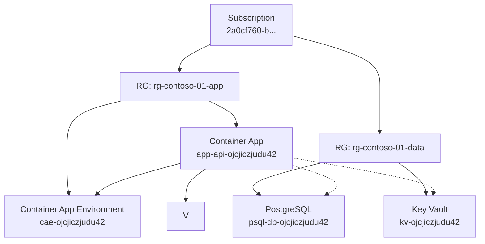

# Azure Resource Dependency Graph Generator

This tool generates a visual dependency graph of resources in your Azure subscription, helping you understand the relationships between different Azure services.

## Features

- **Automatic Resource Discovery**: Scans your Azure subscription for all resources
- **Dependency Analysis**: Identifies both confirmed and potential dependencies between resources
- **Visual Diagram**: Generates a Mermaid.js diagram showing the resource hierarchy and relationships
- **Resource Grouping**: Organizes resources by resource group and type for clarity
- **Customizable Output**: Save the diagram to a Markdown file for easy sharing

## Prerequisites

- Python 3.6 or later
- Azure CLI installed and configured
- Azure Resource Graph enabled for your subscription

## Installation

1. Clone this repository:

```bash
git clone https://github.com/yourusername/azure-resource-graph.git
cd azure-resource-graph
```

2. Make the script executable:

```bash
chmod +x azure_resource_graph.py
```

## Usage

Run the tool with your Azure subscription:

```bash
./azure_resource_graph.py
```

By default, the tool uses your current Azure CLI subscription. You can specify a different subscription:

```bash
./azure_resource_graph.py --subscription "xxxxxxxx-xxxx-xxxx-xxxx-xxxxxxxxxxxx"
```

The output will be saved as `azure_resources_diagram.md` by default. You can specify a different output file:

```bash
./azure_resource_graph.py --output "my_diagram.md"
```

### Options

| Option | Description |
|--------|-------------|
| `--subscription`, `-s` | Specify the Azure subscription ID (if not provided, uses current subscription) |
| `--output`, `-o` | Specify the output Markdown file path (default: azure_resources_diagram.md) |
| `--no-potential-deps` | Exclude potential dependencies from the diagram (show only confirmed dependencies) |

### Dependency Types

The tool identifies two types of dependencies:

1. **Confirmed Dependencies** (solid lines): Direct connections found in resource properties that explicitly reference other resources.
2. **Potential Dependencies** (dotted lines): Inferred connections based on common architectural patterns (can be disabled with `--no-potential-deps`).

Example:
```bash
# Include only confirmed dependencies
./azure_resource_graph.py --no-potential-deps
```

## Example Output

The tool generates a Markdown file containing a Mermaid.js diagram. Here's an example:



## Interpretation

In the generated diagram:

- **Solid lines** represent confirmed dependencies between resources
- **Dotted lines** represent potential dependencies based on common architectural patterns
- Resources are organized by resource group and then by type

## How It Works

1. The tool uses Azure CLI to authenticate and access your Azure subscription
2. It queries the Azure Resource Graph to discover all resources and resource groups
3. It analyzes resource properties to identify dependencies
4. For certain resource types, it applies heuristics to detect potential dependencies
5. Finally, it generates a Mermaid.js diagram showing the resource hierarchy and relationships

## Documentation

For more details on how the tool works and how to extend it:

- [DEPENDENCIES.md](DEPENDENCIES.md) - Detailed explanation of how resource dependencies are detected
- [EXTENDING.md](EXTENDING.md) - Guide for extending the tool to support additional Azure resource types

## Limitations

- The tool can only detect dependencies that are explicitly defined in resource properties
- Some dependencies might be missed if they're not reflected in the Azure Resource Graph
- The tool cannot detect dependencies outside the subscription boundary

## Contributing

Contributions are welcome! Please feel free to submit a Pull Request.

## License

This project is licensed under the MIT License - see the LICENSE file for details. 