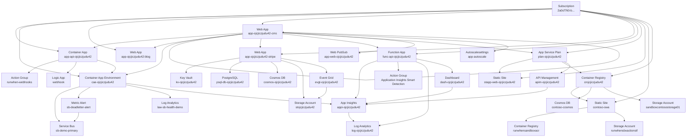

# Azure Resources Dependency Graph

This diagram shows the resources in your Azure subscription and their dependencies.

- Solid lines represent confirmed dependencies

```mermaid
graph TD;
    A[Subscription<br/>2a0cf760-b...]

    %% Resource Groups
    A --> B["azure-apim-health"]
    A --> C["azure-servicebus-health"]
    A --> D["NetworkWatcherRG"]
    A --> E["rg-contoso-01-app"]
    A --> F["rg-contoso-01-data"]
    A --> G["rg-contoso-01-monitoring"]
    A --> H["rg-contoso-01-network"]
    A --> I["runwhen-base-org"]
    A --> J["sandbox"]
    A --> K["sandbox-contoso-rg"]

    %% Containerapps Resources
    E --> B["Container App<br/>app-api-ojcjiczjudu42"]

    %% Managedenvironments Resources
    E --> C["Container App Environment<br/>cae-ojcjiczjudu42"]

    %% Sites Resources
    E --> D["Web App<br/>app-ojcjiczjudu42-blog"]
    E --> E["Web App<br/>app-ojcjiczjudu42-cms"]
    E --> F["Web App<br/>app-ojcjiczjudu42-stripe"]
    E --> G["Function App<br/>func-api-ojcjiczjudu42"]

    %% Serverfarms Resources
    E --> H["App Service Plan<br/>plan-ojcjiczjudu42"]

    %% Staticsites Resources
    H --> I["Static Site<br/>stapp-web-ojcjiczjudu42"]
    K --> J["Static Site<br/>contoso-swa"]

    %% Registries Resources
    H --> K["Container Registry<br/>crojcjiczjudu42"]
    J --> L["Container Registry<br/>runwhensandboxacr"]

    %% Vaults Resources
    F --> M["Key Vault<br/>kv-ojcjiczjudu42"]

    %% Flexibleservers Resources
    F --> N["PostgreSQL<br/>psql-db-ojcjiczjudu42"]

    %% Databaseaccounts Resources
    F --> O["Cosmos DB<br/>cosmos-ojcjiczjudu42"]
    K --> P["Cosmos DB<br/>contoso-cosmos"]

    %% Storageaccounts Resources
    F --> Q["Storage Account<br/>stojcjiczjudu42"]
    K --> R["Storage Account<br/>sandboxcontosostorage01"]
    J --> S["Storage Account<br/>runwhensbxactionstf"]

    %% Namespaces Resources
    C --> T["Service Bus<br/>sb-demo-primary"]

    %% Webpubsub Resources
    E --> U["Web PubSub<br/>app-web-ojcjiczjudu42"]

    %% Components Resources
    G --> V["App Insights<br/>appi-ojcjiczjudu42"]

    %% Actiongroups Resources
    B --> W["Action Group<br/>runwhen-webhooks"]
    G --> X["Action Group<br/>Application Insights Smart Detection"]

    %% Metricalerts Resources
    C --> Y["Metric Alert<br/>sb-deadletter-alert"]

    %% Workspaces Resources
    C --> Z["Log Analytics<br/>law-sb-health-demo"]
    G --> node_1["Log Analytics<br/>log-ojcjiczjudu42"]

    %% Service Resources
    H --> node_2["API Management<br/>apim-ojcjiczjudu42"]

    %% Networkwatchers Resources

    %% Dashboards Resources
    G --> node_5["Dashboard<br/>dash-ojcjiczjudu42"]

    %% Workflows Resources
    B --> node_6["Logic App<br/>webhook"]

    %% Systemtopics Resources
    F --> node_7["Event Grid<br/>evgt-ojcjiczjudu42"]

    %% Autoscalesettings Resources
    E --> node_8["Autoscalesettings<br/>app-autoscale"]

    %% Confirmed Dependencies
    Y --> T
    B --> C
    C --> V
    node_7 --> Q
    V --> node_1
    node_5 --> V
    node_2 --> V

```
