# Azure Resources Dependency Graph

This diagram shows the resources in your Azure subscription and their dependencies.

- Resources are displayed with their proper Azure display names and resource names
- Resource types and kinds are included for better identification
- Solid lines represent confirmed dependencies
- Dotted lines represent potential dependencies based on common patterns

```mermaid
graph TD;
    A[Subscription<br/>2a0cf760-b...]

    %% Resource Groups
    A --> B["azure-ado-triage"]
    A --> C["azure-apim-health"]
    A --> D["azure-rg-triage"]
    A --> E["MC_prats-new-resource_onl-btk_eastus"]
    A --> F["NetworkWatcherRG"]
    A --> G["prats-new-resource"]
    A --> H["rg-contoso-01-app"]
    A --> I["rg-contoso-01-data"]
    A --> J["rg-contoso-01-monitoring"]
    A --> K["rg-contoso-01-network"]
    A --> L["rg-devops-org-health-test-d5a1bb4d"]
    A --> M["runwhen-base-org"]
    A --> N["sandbox"]
    A --> O["sandbox-contoso-rg"]

    %% Containerapps Resources
    H --> B["<b>Container App</b><br/>app-api-ojcjiczjudu42"]

    %% Managedenvironments Resources
    H --> C["<b>Container App Environment</b><br/>cae-ojcjiczjudu42"]

    %% Sites Resources
    H --> D["<b>Linux Web App</b><br/>app-ojcjiczjudu42-blog"]
    H --> E["<b>Linux Web App</b><br/>app-ojcjiczjudu42-cms"]
    H --> F["<b>Linux Web App</b><br/>app-ojcjiczjudu42-stripe"]
    H --> G["<b>Function App</b><br/>func-api-ojcjiczjudu42"]

    %% Serverfarms Resources
    H --> H["<b>App Service Plan</b><br/>plan-ojcjiczjudu42<br/><i>(linux)</i>"]

    %% Staticsites Resources
    K --> I["<b>Static Site</b><br/>stapp-web-ojcjiczjudu42"]
    O --> J["<b>Static Site</b><br/>contoso-swa"]

    %% Registries Resources
    K --> K["<b>Container Registry</b><br/>crojcjiczjudu42"]
    N --> L["<b>Container Registry</b><br/>runwhensandboxacr"]

    %% Vaults Resources
    I --> M["<b>Key Vault</b><br/>kv-ojcjiczjudu42"]

    %% Flexibleservers Resources
    I --> N["<b>PostgreSQL</b><br/>psql-db-ojcjiczjudu42"]

    %% Databaseaccounts Resources
    I --> O["<b>Cosmos DB (MongoDB)</b><br/>cosmos-ojcjiczjudu42<br/><i>(MongoDB)</i>"]
    O --> P["<b>Cosmos DB</b><br/>contoso-cosmos<br/><i>(GlobalDocumentDB)</i>"]

    %% Storageaccounts Resources
    I --> Q["<b>Storage Account v2</b><br/>stojcjiczjudu42<br/><i>(StorageV2)</i>"]
    O --> R["<b>Storage Account v2</b><br/>sandboxcontosostorage01<br/><i>(StorageV2)</i>"]
    N --> S["<b>Storage Account v2</b><br/>runwhensbxactionstf<br/><i>(StorageV2)</i>"]

    %% Webpubsub Resources
    H --> T["<b>Web PubSub</b><br/>app-web-ojcjiczjudu42<br/><i>(WebPubSub)</i>"]

    %% Components Resources
    J --> U["<b>App Insights</b><br/>appi-ojcjiczjudu42<br/><i>(web)</i>"]

    %% Workspaces Resources
    J --> V["<b>Log Analytics</b><br/>log-ojcjiczjudu42"]

    %% Service Resources
    K --> W["<b>API Management</b><br/>apim-ojcjiczjudu42"]

    %% Networkwatchers Resources

    %% Workflows Resources
    C --> Z["<b>Logic App</b><br/>webhook"]

    %% Virtualmachinescalesets Resources

    %% Userassignedidentities Resources

    %% Loadbalancers Resources

    %% Networksecuritygroups Resources

    %% Publicipaddresses Resources

    %% Virtualnetworks Resources

    %% Managedclusters Resources
    G --> node_8["<b>AKS Cluster</b><br/>onl-btk"]

    %% Autoscalesettings Resources
    H --> node_9["<b>Autoscalesettings</b><br/>app-autoscale"]

    %% Activitylogalerts Resources
    K --> node_10["<b>Activitylogalerts</b><br/>Test"]

    %% Confirmed Dependencies
    node_1 --> node_3
    node_1 --> node_7
    node_3 --> node_1
    node_3 --> node_6
    node_3 --> node_5
    node_4 --> node_7
    node_5 --> node_3
    node_8 --> node_5
    B --> C
    U --> V

    %% Potential Dependencies
    node_1 -.-> node_3
    node_3 -.-> node_3
    node_3 -.-> node_6
    node_3 -.-> node_5
    C -.-> U
    D -.-> D
    E -.-> E
    F -.-> F
    G -.-> O
    G -.-> M
    G -.-> N
    G -.-> F
    G -.-> Q
    G -.-> G
    W -.-> U

```

